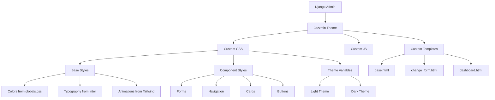

# Дизайн современной стилизации Jazzmin Django

## Обзор

Данный документ описывает дизайн современной админ-панели Django с использованием темы Jazzmin. Дизайн основан на переиспользовании существующих стилей проекта Guscha и создании единообразного пользовательского опыта между основным сайтом и админ-панелью.

## Архитектура

### Структура стилей

```
guscha_django/
├── static/
│   └── admin/
│       └── css/
│           ├── jazzmin-custom.css      # Основные кастомные стили
│           ├── jazzmin-dark.css        # Темная тема
│           └── jazzmin-components.css  # Компоненты и виджеты
└── templates/
    └── admin/
        ├── base.html                   # Базовый шаблон админки
        └── change_form.html            # Шаблон форм редактирования
```

### Переиспользование стилей

Дизайн будет переиспользовать следующие элементы из основного проекта:

1. **Цветовая палитра** из `globals.css`:
   - Primary: `#111` (основной черный)
   - Secondary: `#f1f1f1` (светло-серый)
   - Accent: `#007bff` (синий акцент)
   - Background: `#232323` (темно-серый фон)

2. **Типографика** из `Inter` шрифта:
   - Веса: 300, 400, 500, 600, 700, 800, 900
   - Улучшенные настройки: `font-feature-settings: 'cv02', 'cv03', 'cv04', 'cv11'`

3. **Компоненты** из Tailwind конфигурации:
   - Анимации: fade-in, slide-up, slide-down
   - Spacing система
   - Адаптивные breakpoints

## Компоненты и интерфейсы

### 1. Главная страница админки

**Дизайн:**
- Современные карточки статистики с тенями и скругленными углами
- Использование CSS Grid для адаптивной сетки
- Иконки Font Awesome для визуального представления метрик
- Цветовое кодирование для разных типов данных

**Компоненты:**
- Карточки метрик (общее количество товаров, заказы, пользователи)
- Быстрые действия (добавить товар, просмотреть заказы)
- Последние активности

### 2. Боковая панель навигации

**Дизайн:**
- Минималистичный дизайн с четкой иерархией
- Hover-эффекты с плавными переходами
- Группировка связанных разделов
- Адаптивное сворачивание на мобильных устройствах

**Структура меню:**
```
📊 Панель управления
├── 🛍️ Товары
│   ├── Все товары
│   ├── Категории
│   └── Добавить товар
├── 📦 Заказы
│   ├── Все заказы
│   ├── В обработке
│   └── Завершенные
├── 👥 Пользователи
│   ├── Все пользователи
│   └── Группы
└── ⚙️ Настройки
    ├── Адреса
    └── Система
```

### 3. Формы редактирования товаров

**Дизайн:**
- Горизонтальные вкладки для группировки полей
- Современные поля ввода с floating labels
- Drag & drop загрузка изображений с превью
- Валидация в реальном времени

**Группировка полей:**
- **Основная информация**: название, описание, цена
- **Медиа**: изображения, видео
- **Категоризация**: категория, теги, бренд
- **Настройки**: статус, видимость, SEO

### 4. Темная тема

**Автоматическое переключение:**
- Определение системных предпочтений через `prefers-color-scheme`
- Плавные переходы между темами
- Сохранение пользовательских настроек

**Цветовая схема темной темы:**
- Фон: `#1a1a1a`
- Карточки: `#2d2d2d`
- Текст: `#e0e0e0`
- Акценты: `#4a9eff`

## Модели данных

### Конфигурация Jazzmin

```python
JAZZMIN_SETTINGS = {
    # Брендинг
    "site_title": "Guscha Admin",
    "site_header": "Guscha Store",
    "site_brand": "Guscha",
    "site_logo": "images/guscha-logo-admin.svg",
    "login_logo": "images/guscha-logo-login.svg",
    "site_logo_classes": "img-fluid",
    "site_icon": "images/favicon-admin.ico",
    
    # Приветствие и копирайт
    "welcome_sign": "Добро пожаловать в панель управления Guscha",
    "copyright": "Guscha Store © 2025",
    
    # Поиск
    "search_model": ["products.Product", "accounts.User", "orders.Order"],
    
    # Меню
    "topmenu_links": [
        {"name": "Главная", "url": "admin:index", "permissions": ["auth.view_user"]},
        {"name": "Сайт", "url": "/", "new_window": True},
        {"model": "accounts.User"},
    ],
    
    # Настройки интерфейса
    "show_sidebar": True,
    "navigation_expanded": True,
    "changeform_format": "horizontal_tabs",
    
    # Кастомные файлы
    "custom_css": "admin/css/jazzmin-custom.css",
    "custom_js": "admin/js/jazzmin-custom.js",
    
    # Иконки
    "icons": {
        "products": "fas fa-shopping-bag",
        "products.product": "fas fa-box",
        "products.category": "fas fa-tags",
        "orders": "fas fa-shopping-cart",
        "orders.order": "fas fa-receipt",
        "accounts": "fas fa-users",
        "accounts.user": "fas fa-user",
        "addresses": "fas fa-map-marker-alt",
    },
}

JAZZMIN_UI_TWEAKS = {
    "navbar_small_text": False,
    "footer_small_text": False,
    "body_small_text": False,
    "brand_small_text": False,
    "brand_colour": False,
    "accent": "accent-primary",
    "navbar": "navbar-dark",
    "no_navbar_border": False,
    "navbar_fixed": False,
    "layout_boxed": False,
    "footer_fixed": False,
    "sidebar_fixed": False,
    "sidebar": "sidebar-dark-primary",
    "sidebar_nav_small_text": False,
    "sidebar_disable_expand": False,
    "sidebar_nav_child_indent": False,
    "sidebar_nav_compact_style": False,
    "sidebar_nav_legacy_style": False,
    "sidebar_nav_flat_style": False,
    "theme": "flatly",
    "dark_mode_theme": "darkly",
    "button_classes": {
        "primary": "btn-primary",
        "secondary": "btn-secondary",
        "info": "btn-info",
        "warning": "btn-warning",
        "danger": "btn-danger",
        "success": "btn-success"
    }
}
```

## Обработка ошибок

### Валидация форм
- Клиентская валидация с мгновенной обратной связью
- Серверная валидация с понятными сообщениями об ошибках
- Подсветка полей с ошибками

### Уведомления
- Toast-уведомления для успешных операций
- Модальные окна для критических ошибок
- Прогресс-бары для длительных операций

## Стратегия тестирования

### Визуальное тестирование
1. Проверка отображения во всех поддерживаемых браузерах
2. Тестирование адаптивности на разных размерах экранов
3. Проверка темной и светлой тем

### Функциональное тестирование
1. Тестирование всех форм и их валидации
2. Проверка навигации и поиска
3. Тестирование загрузки файлов

### Производительность
1. Оптимизация CSS и JS файлов
2. Ленивая загрузка изображений
3. Минификация ресурсов

## Диаграмма архитектуры



## Адаптивный дизайн

### Breakpoints (из Tailwind конфигурации)
- `xs`: 475px - мобильные устройства
- `sm`: 640px - большие мобильные
- `md`: 768px - планшеты
- `lg`: 1024px - ноутбуки
- `xl`: 1280px - десктопы

### Адаптивные изменения
1. **Мобильные устройства (< 768px)**:
   - Сворачиваемая боковая панель
   - Вертикальное расположение форм
   - Упрощенная навигация

2. **Планшеты (768px - 1024px)**:
   - Компактная боковая панель
   - Двухколоночные формы
   - Сенсорно-оптимизированные элементы

3. **Десктопы (> 1024px)**:
   - Полная боковая панель
   - Многоколоночные формы
   - Расширенные возможности навигации