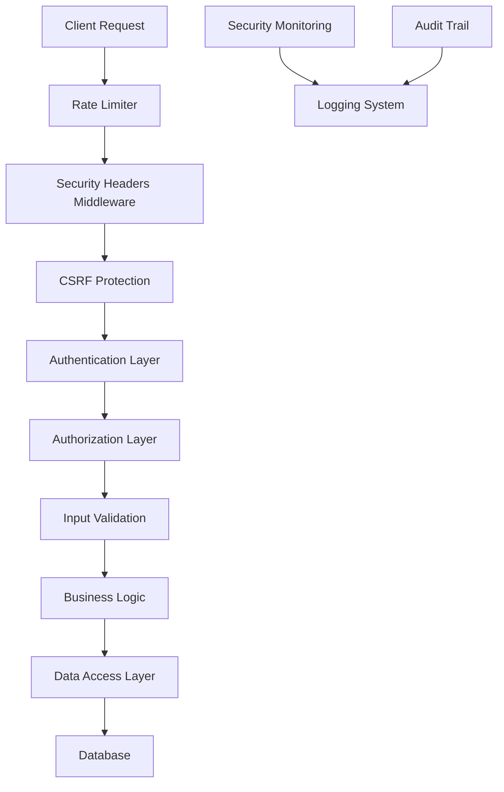
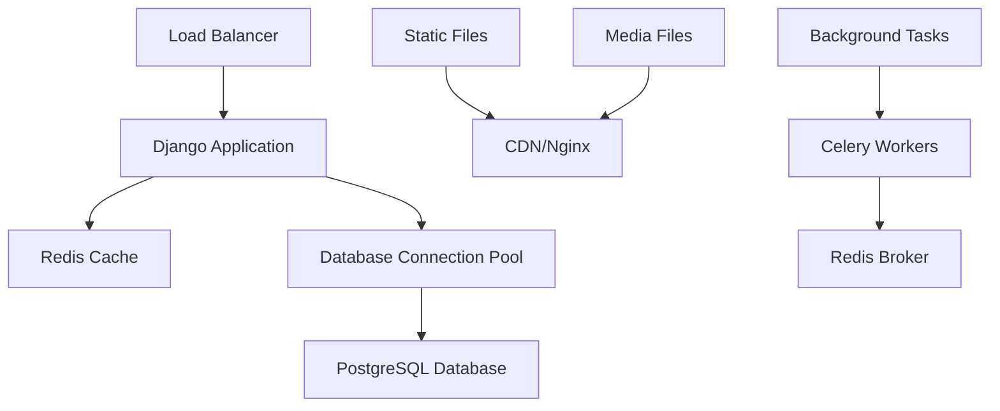
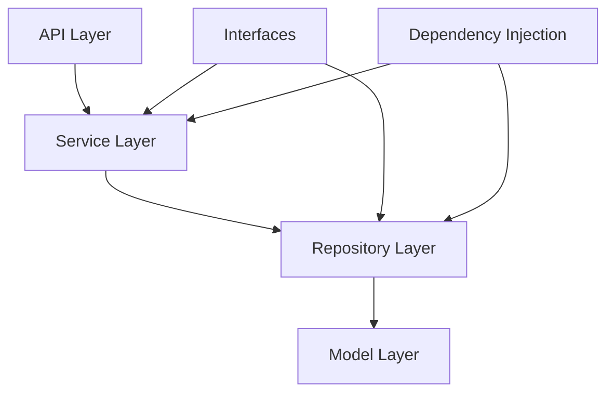

# Design Document

## Overview

This design document outlines the comprehensive security, performance, and code quality improvements for the Django e-commerce application. The solution follows SOLID and KISS principles while implementing industry-standard security practices and performance optimizations.

The current architecture consists of:
- **Backend**: Django 5.2.4 with Django REST Framework
- **Frontend**: React 19.1.0 with TypeScript support
- **Database**: SQLite (development), with migration path to PostgreSQL
- **Authentication**: Custom User model with Token/Session authentication
- **Security**: Basic CORS, CSRF protection, some security headers

## Architecture

### Security Architecture



### Performance Architecture



### Code Architecture (SOLID Principles)



## Components and Interfaces

### 1. Security Components

#### SecurityService Interface
```python
class SecurityService:
    def validate_input(self, data: dict) -> dict
    def sanitize_output(self, data: dict) -> dict
    def check_permissions(self, user: User, resource: str, action: str) -> bool
    def log_security_event(self, event: SecurityEvent) -> None
```

#### RateLimitService Interface
```python
class RateLimitService:
    def is_allowed(self, identifier: str, limit_type: str) -> bool
    def increment_counter(self, identifier: str, limit_type: str) -> None
    def get_remaining_attempts(self, identifier: str, limit_type: str) -> int
```

### 2. Performance Components

#### CacheService Interface
```python
class CacheService:
    def get(self, key: str) -> Optional[Any]
    def set(self, key: str, value: Any, timeout: int = None) -> None
    def delete(self, key: str) -> None
    def invalidate_pattern(self, pattern: str) -> None
```

#### QueryOptimizer Interface
```python
class QueryOptimizer:
    def optimize_queryset(self, queryset: QuerySet) -> QuerySet
    def add_select_related(self, queryset: QuerySet, fields: List[str]) -> QuerySet
    def add_prefetch_related(self, queryset: QuerySet, fields: List[str]) -> QuerySet
```

### 3. Repository Pattern Implementation

#### BaseRepository Interface
```python
class BaseRepository(ABC):
    @abstractmethod
    def get_by_id(self, id: int) -> Optional[Model]
    
    @abstractmethod
    def get_all(self, filters: dict = None) -> QuerySet
    
    @abstractmethod
    def create(self, data: dict) -> Model
    
    @abstractmethod
    def update(self, id: int, data: dict) -> Model
    
    @abstractmethod
    def delete(self, id: int) -> bool
```

### 4. Service Layer Implementation

#### BaseService Interface
```python
class BaseService(ABC):
    def __init__(self, repository: BaseRepository, cache_service: CacheService):
        self.repository = repository
        self.cache_service = cache_service
    
    @abstractmethod
    def get_by_id(self, id: int) -> Optional[dict]
    
    @abstractmethod
    def create(self, data: dict) -> dict
    
    @abstractmethod
    def update(self, id: int, data: dict) -> dict
    
    @abstractmethod
    def delete(self, id: int) -> bool
```

## Data Models

### Enhanced Security Models

#### SecurityEvent Model
```python
class SecurityEvent(models.Model):
    event_type = models.CharField(max_length=50)
    user = models.ForeignKey(User, on_delete=models.SET_NULL, null=True)
    ip_address = models.GenericIPAddressField()
    user_agent = models.TextField()
    timestamp = models.DateTimeField(auto_now_add=True)
    details = models.JSONField(default=dict)
    severity = models.CharField(max_length=20, choices=SEVERITY_CHOICES)
```

#### AuditLog Model
```python
class AuditLog(models.Model):
    user = models.ForeignKey(User, on_delete=models.SET_NULL, null=True)
    action = models.CharField(max_length=100)
    model_name = models.CharField(max_length=100)
    object_id = models.PositiveIntegerField()
    changes = models.JSONField(default=dict)
    timestamp = models.DateTimeField(auto_now_add=True)
    ip_address = models.GenericIPAddressField()
```

### Performance Optimization Models

#### CacheEntry Model
```python
class CacheEntry(models.Model):
    key = models.CharField(max_length=255, unique=True)
    value = models.JSONField()
    expires_at = models.DateTimeField()
    created_at = models.DateTimeField(auto_now_add=True)
    hit_count = models.PositiveIntegerField(default=0)
```

## Error Handling

### Centralized Error Handler

```python
class APIErrorHandler:
    def handle_validation_error(self, error: ValidationError) -> Response
    def handle_permission_error(self, error: PermissionDenied) -> Response
    def handle_not_found_error(self, error: Http404) -> Response
    def handle_rate_limit_error(self, error: RateLimitExceeded) -> Response
    def handle_generic_error(self, error: Exception) -> Response
```

### Error Response Format

```json
{
    "error": {
        "code": "VALIDATION_ERROR",
        "message": "Invalid input data",
        "details": {
            "field_errors": {
                "email": ["This field is required"]
            }
        },
        "timestamp": "2025-01-15T10:30:00Z",
        "request_id": "req_123456789"
    }
}
```

## Testing Strategy

### 1. Security Testing

#### Unit Tests
- Input validation tests
- Authentication/authorization tests
- CSRF protection tests
- Rate limiting tests

#### Integration Tests
- API security tests
- End-to-end authentication flows
- Permission boundary tests

#### Security Scanning
- OWASP ZAP automated scanning
- Dependency vulnerability scanning
- Static code analysis with Bandit

### 2. Performance Testing

#### Load Testing
- API endpoint load tests with Locust
- Database query performance tests
- Cache effectiveness tests

#### Monitoring Tests
- Response time monitoring
- Memory usage monitoring
- Database connection pool monitoring

### 3. Code Quality Testing

#### Unit Tests
- Service layer tests with mocks
- Repository pattern tests
- SOLID principle compliance tests

#### Integration Tests
- API contract tests
- Database integration tests
- Cache integration tests

## Implementation Phases

### Phase 1: Security Foundation
1. Implement security middleware stack
2. Add input validation and sanitization
3. Enhance authentication and authorization
4. Add security logging and monitoring

### Phase 2: Performance Optimization
1. Implement caching layer
2. Optimize database queries
3. Add connection pooling
4. Implement background task processing

### Phase 3: Code Quality Refactoring
1. Implement repository pattern
2. Add service layer abstraction
3. Refactor to follow SOLID principles
4. Add comprehensive testing

### Phase 4: Monitoring and Maintenance
1. Add performance monitoring
2. Implement health checks
3. Add automated security scanning
4. Create deployment automation

## Security Considerations

### Authentication & Authorization
- Multi-factor authentication support
- Role-based access control (RBAC)
- Object-level permissions with django-guardian
- JWT token management with refresh tokens

### Data Protection
- Field-level encryption for sensitive data
- PII data anonymization
- Secure file upload handling
- Database query parameterization

### Network Security
- HTTPS enforcement
- Security headers (HSTS, CSP, etc.)
- CORS configuration
- Rate limiting per IP/user

### Monitoring & Auditing
- Security event logging
- Failed authentication tracking
- Suspicious activity detection
- Audit trail for data changes

## Performance Optimizations

### Database Optimizations
- Query optimization with select_related/prefetch_related
- Database indexing strategy
- Connection pooling
- Read/write database splitting

### Caching Strategy
- Redis for session and cache storage
- API response caching
- Database query result caching
- Static file caching with CDN

### Frontend Optimizations
- Code splitting and lazy loading
- Image optimization and lazy loading
- Bundle size optimization
- Service worker for offline support

### Background Processing
- Celery for async task processing
- Email sending optimization
- Report generation optimization
- Data export/import optimization